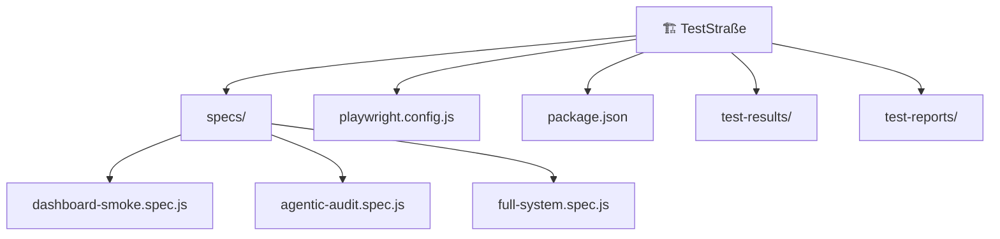

# 📋 DkZ™ TestStraße — Vollständiges Test-Schema

> Stand: 2026-05-27 · Playwright E2E · Chromium
> Pfad: `C:\DEVKiTZ\01_PROJECTS\01_dashboard\tests\`

---

## Architektur



---

## Konfiguration

| Key | Wert |
|:----|:-----|
| **Framework** | Playwright `^1.60.0` |
| **Browser** | Chromium |
| **Viewport** | 1440 × 900 |
| **Base URL** | `file:///C:/DEVKiTZ/01_PROJECTS` (Specs) / `http://localhost:8080` (Full) |
| **Reporter** | HTML + JSON + List |
| **Retries** | 0 (lokal), 2 (CI) |
| **Workers** | Auto (lokal), 1 (CI) |
| **Traces** | On first retry |
| **Screenshots** | Only on failure |
| **Video** | Retain on failure |

---

## NPM Scripts

```bash
npm test                    # Alle Tests ausführen
npm run test:headed         # Tests mit sichtbarem Browser
npm run test:ui             # Playwright UI-Modus
npm run test:debug          # Debug-Modus (Breakpoints)
npm run test:smoke          # Nur @smoke Tests
npm run test:stress         # Nur @stress Tests
npm run test:report         # HTML-Report öffnen
npm run install-browsers    # Chromium installieren
```

### 10x Wiederholung (Stress-Test)

```bash
npx playwright test specs/full-system.spec.js --repeat-each=10 --reporter=list
```

---

## Spec-Dateien

### 1. `dashboard-smoke.spec.js` — 15 Tests

Blog Hub Basis-Tests. Prüft Grundfunktionalität des Blog-Hubs.

| # | Test | Methode | Beschreibung |
|:--|:-----|:--------|:-------------|
| 1 | Seite lädt und hat Titel | `toHaveTitle(/DkZ\|Blog Hub/i)` | Title-Tag Prüfung |
| 2 | Intro-Screen sichtbar | `toBeAttached()` auf `#intro` | Intro-Element existiert |
| 3 | Dashboard nach Skip-Intro | `skipIntro()` → `toBeVisible()` | App-Container sichtbar nach Intro-Skip |
| 4 | Filter-Buttons vorhanden | `locator('.fbtn')` Count | Filter-Bar hat Buttons |
| 5 | Post-Cards gerendert | `.g .tile` Count > 0 | Mindestens 1 Post-Card |
| 6 | NanoBot Badge sichtbar | `#dkz-nanobot-badge` visible | NanoBot-Icon am Rand |
| 7 | Meta-Tags korrekt | viewport, description, charset | SEO-Basis vorhanden |
| 8 | Kein Overflow | `scrollWidth <= innerWidth + 5` | Kein horizontaler Scroll |
| 9 | Keine Console-Errors | `page.on('pageerror')` | 0 JS-Exceptions |
| 10 | Filter klicken filtert | `.fbtn.nth(1).click()` | Klick ändert Ansicht |
| 11 | NanoBot öffnet Panel | Badge → Click → Panel visible | Chat-Panel öffnet sich |
| 12 | NanoBot `.help` Befehl | Input `.help` → Enter → Text | Help-Output enthält "Befehle" |
| 13 | Ladezeit < 3s | `Date.now()` Diff | Performance-Schwelle |
| 14 | DOM < 3000 Nodes | `querySelectorAll('*').length` | DOM-Größe Check |
| 15 | Rapid-Click (50x) | 50x `body.click()` | Crash-Resistenz |

#### Helper-Methoden

```javascript
// Intro-Screen programmatisch überspringen
async function skipIntro(page) {
  await page.goto(BLOG_HUB);
  await page.evaluate(() => {
    document.getElementById('intro')?.classList.add('gone');
    document.getElementById('app')?.classList.add('show');
    if (typeof ContentEngine !== 'undefined') ContentEngine.init();
  });
  await page.waitForTimeout(1500);
}
```

---

### 2. `agentic-audit.spec.js` — 6 Tests

Agentic Pattern Audit. Prüft AI/LLM-Bereitschaft und Shared Scripts.

| # | Test | Methode | Beschreibung |
|:--|:-----|:--------|:-------------|
| 1 | Meta-Tags für AI/LLM | `evaluate()` → meta-Objekt | viewport, description, charset, title |
| 2 | Keine broken Links | `querySelectorAll('a[href]')` | Alle Links extrahierbar |
| 3 | Keyboard Shortcuts | `typeof DkzTest !== 'undefined'` | Test-Script geladen |
| 4 | Semantisches HTML | h1, footer, main Check | Barrierefreiheit-Basis |
| 5 | DkZ Shared Scripts | DkzTest, DkzQA, DkzStress | Shared Scripts aktiv |
| 6 | API Gateway Health | `GET /health` → 200 | ONTHERUN Gateway (skip wenn offline) |

---

### 3. `full-system.spec.js` — 42+ Tests

**Vollständiger System-Test** über alle Dashboard-Module. Beinhaltet Gemini-Elimination-Check.

#### 1️⃣ Hub — Hauptseite (3 Tests)

| # | Test | Methode |
|:--|:-----|:--------|
| 1 | Hub lädt und zeigt Module | `toHaveTitle()` |
| 2 | Hub hat Suchfeld | `input` Locator Count > 0 |
| 3 | Hub zeigt Kategorie-Tabs | Content Match `/Alle\|AI\|Tools/` |

#### 2️⃣ Agent Builder — Gemini-Elimination (8 Tests) ⚠️ KRITISCH

| # | Test | Methode | Beschreibung |
|:--|:-----|:--------|:-------------|
| 1 | Agent Builder lädt | `toBeVisible()` | Seite rendern |
| 2 | **KEIN Gemini in Dropdowns** | `select option` → filter `gemini` → Length 0 | **Gemini-Purge Verifikation** |
| 3 | **gemma-4-2b ist Default** | `content.toContain('gemma-4-2b')` | Neues Default-Modell |
| 4 | **qwen-coder-7b verfügbar** | `content.toContain('qwen-coder-7b')` | Backend-Modell |
| 5 | Knoten-Palette (5 Typen) | `.node-item` Count ≥ 5 | Input/Output/LLM/Tool/Agent |
| 6 | Pattern laden (JS Check) | `typeof loadPattern === 'function'` | Funktion existiert |
| 7 | **Pattern kein Gemini** | `loadPattern('chain')` → S.nodes Models | Kein Gemini in generierten Knoten |
| 8 | **YAML-Export kein Gemini** | `getGraphJSON()` → JSON Check | Export enthält kein Gemini |

#### 3️⃣ Action Builder (2 Tests)

| # | Test | Methode |
|:--|:-----|:--------|
| 1 | Action Builder lädt | Content Check |
| 2 | **Kein Gemini Flash** + Gemma/Qwen vorhanden | HTML Content Assertion |

#### 4️⃣ JAMEZ Builder (2 Tests)

| # | Test | Methode |
|:--|:-----|:--------|
| 1 | JAMEZ Builder lädt | Content Check |
| 2 | **Kein Gemini** im `#jz-model` Select | Options Array Filter + Gemma/Qwen Prüfung |

#### 5️⃣ WissenHub (2 Tests)

| # | Test | Methode |
|:--|:-----|:--------|
| 1 | WissenHub lädt | `toBeVisible()` |
| 2 | Tabs vorhanden | Content Match `Impl\|Walk\|Research\|Task` |

#### 6️⃣ Builder Chain Module (8 Tests)

Jedes Modul wird auf Ladbarkeit geprüft:

| # | Modul | Pfad |
|:--|:------|:-----|
| 1 | Skill Builder | `skill-builder/index.html` |
| 2 | Workflow Builder | `workflow-builder/index.html` |
| 3 | Team Builder | `team-builder/index.html` |
| 4 | Tenor Builder | `tenor-builder/index.html` |
| 5 | NanoBot Center | `nanobot-center/index.html` |
| 6 | Kanban Board | `kanban-board/index.html` |
| 7 | Loop Dashboard | `loop-dashboard/index.html` |
| 8 | Second Brain | `second-brain/index.html` |

#### 7️⃣ Utility Module (10 Tests)

| # | Modul | Pfad |
|:--|:------|:-----|
| 1 | Settings | `settings/index.html` |
| 2 | VPS Monitor | `vps-monitor/index.html` |
| 3 | Security Scanner | `security-scanner/index.html` |
| 4 | Prompt Generator | `prompt-generator/index.html` |
| 5 | Free AI Hub | `free-ai-hub/index.html` |
| 6 | LLM Arena | `llm-arena/index.html` |
| 7 | NLM Builder | `nlm-builder/index.html` |
| 8 | Graphify | `graphify/index.html` |
| 9 | Ecosystem Analyzer | `ecosystem-analyzer/index.html` |
| 10 | System Check | `system-check/index.html` |

#### 8️⃣ Performance & Stabilität (3 Tests)

| # | Test | Methode | Schwelle |
|:--|:-----|:--------|:---------|
| 1 | Hub Ladezeit | `Date.now()` Diff | < 5000ms |
| 2 | Agent Builder DOM | `querySelectorAll('*').length` | < 5000 Nodes |
| 3 | Kein Overflow Hub | `scrollWidth <= innerWidth + 10` | Kein H-Scroll |

#### 9️⃣ Console Error Check (5 Tests)

Prüft auf JS-Exceptions in kritischen Seiten (max 2 Fehler erlaubt für 404-Shared-Scripts):

| # | Seite |
|:--|:------|
| 1 | `hub/index.html` |
| 2 | `modules/agent-builder/index.html` |
| 3 | `modules/action-builder/index.html` |
| 4 | `modules/wissen-hub/index.html` |
| 5 | `modules/kanban-board/index.html` |

---

## Test-Methoden Referenz

### Playwright Assertions

| Methode | Verwendung |
|:--------|:-----------|
| `expect(page).toHaveTitle(regex)` | Prüft Seitentitel |
| `expect(locator).toBeVisible()` | Element ist sichtbar |
| `expect(locator).toBeAttached()` | Element im DOM vorhanden |
| `expect(locator).toHaveCount(n)` | Genau n Elemente |
| `expect(value).toContain(str)` | String enthält Substring |
| `expect(value).not.toContain(str)` | String enthält NICHT |
| `expect(value).toMatch(regex)` | Regex-Match |
| `expect(array).toHaveLength(n)` | Array-Länge |
| `expect(n).toBeGreaterThan(x)` | Numerischer Vergleich |
| `expect(n).toBeLessThan(x)` | Numerischer Vergleich |
| `expect(bool).toBeTruthy()` | Boolean Check |

### Page Methoden

| Methode | Beschreibung |
|:--------|:-------------|
| `page.goto(url)` | Navigation |
| `page.waitForLoadState('domcontentloaded')` | DOM ready warten |
| `page.waitForTimeout(ms)` | Explizites Warten |
| `page.evaluate(() => ...)` | JS im Browser ausführen |
| `page.content()` | Gesamtes HTML holen |
| `page.locator(sel)` | Element-Selektor |
| `page.on('pageerror', fn)` | JS-Error abfangen |
| `locator.click()` | Element klicken |
| `locator.fill(str)` | Input ausfüllen |
| `locator.press('Enter')` | Taste drücken |
| `locator.count()` | Anzahl Elemente |
| `locator.textContent()` | Text extrahieren |

### Custom Helper

| Helper | Datei | Beschreibung |
|:-------|:------|:-------------|
| `skipIntro(page)` | dashboard-smoke | Intro programmatisch überspringen |
| `esc(s)` | Agent Builder | XSS-sichere Text-Escaping |
| `screenToCanvas(x,y)` | Agent Builder | Screen→Canvas Koordinaten |

---

## Ausführungs-Befehle

```bash
# Alle Tests einmal
npx playwright test

# Nur Full-System-Test
npx playwright test specs/full-system.spec.js

# 10x Wiederholung (Stress)
npx playwright test specs/full-system.spec.js --repeat-each=10

# Nur Gemini-Elimination Tests
npx playwright test specs/full-system.spec.js --grep "Gemini"

# Nur Smoke Tests
npx playwright test --grep @smoke

# Mit sichtbarem Browser
npx playwright test --headed

# Debug-Modus
npx playwright test --debug

# HTML-Report generieren
npx playwright test --reporter=html
npx playwright show-report
```

---

## Pre-Commit Hook (Git)

Die TestStraße wird **automatisch** bei jedem `git commit` ausgeführt:

```
═══════════════════════════════════════
🧪 DkZ™ Pre-Commit TestStraße
═══════════════════════════════════════
📋 Running Playwright E2E smoke tests...
  12 passed (18.3s)
✅ E2E Tests passed.
✅ All quality checks passed — Commit allowed!
═══════════════════════════════════════
```

---

## Test-Statistiken

| Metrik | Wert |
|:-------|:-----|
| **Spec-Dateien** | 3 |
| **Gesamt-Tests** | ~63 |
| **Smoke Tests** | 15 |
| **Agentic Audit** | 6 |
| **Full System** | 42+ |
| **Module getestet** | 25+ |
| **Gemini-Checks** | 6 dedizierte |
| **Performance** | 3 |
| **Console-Error** | 5 |
| **Durchschnittl. Laufzeit** | ~20s (Smoke), ~45s (Full) |

---

*Generiert: 2026-05-27 · DkZ™ TestStraße v2.0*
