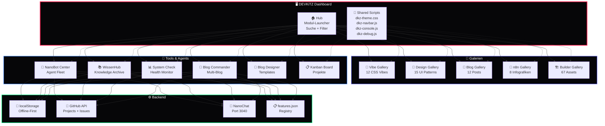

<div align="center">

# 🖥️ DEVKiTZ™ Dashboard

### 132+ Module · Kanban · Hub · Builder · Ökosystem · Offline-First

*Das vollständige KI-Entwickler-Dashboard — Vanilla HTML5/CSS3/JS · Glassmorphism · Dark Mode · Zero Framework*

---


</div>

---

## 📖 Überblick

**DEVKiTZ™ Dashboard** ist das zentrale Frontend des KI-Entwickler-Ökosystems. Mit über **132 Modulen** deckt es alles ab — von Blog-Management über n8n-Workflows bis hin zu Agent-Orchestrierung. Gebaut in reinem Vanilla HTML5/CSS3/JavaScript, komplett ohne Frameworks.

> **Designprinzip:** Schwarz (#060608) + Neon Rot (#fa1e4e) + Glassmorphism. Jedes Modul ist eigenständig lauffähig und teilt sich Shared Scripts. Kein React, kein Vue, kein Angular — niemals.

---

## 🏛️ Architektur



---

## 📦 Modul-Katalog (132+)

### 🎨 Design & Galerien (8 Module)

| Modul | AppID | Features | Status |
|:------|:------|:---------|:-------|
| 🎨 **Vibe Gallery** | DKZ-VIB-001 | 12 CSS Vibes, Lightbox, Filter, Copy CSS | `🟢 v0.01` |
| 🎨 **Design Gallery** | DKZ-DSG-002 | 15 UI Patterns, Live Preview, Token Grid | `🟢 v0.01` |
| 🏗️ **Builder Gallery** | DKZ-BLD-001 | 67 Design Assets, Kategorien | `🟢 Active` |
| 🎨 **DkZ Design Studio** | DKZ-DST-001 | Vollständiges Design-Tool | `🟢 Active` |
| 📸 **Gallery** | DKZ-GAL-001 | Screenshot-Archiv, 3.608+ Screenshots | `🟢 Active` |
| 🌊 **OpenClaw Vibe** | DKZ-OCV-001 | Vibe Coding Interface | `🟢 Active` |
| 🎨 **Theme Editor** | DKZ-THE-001 | CSS Variable Live-Editor | `🟢 Active` |
| 📐 **Layout Builder** | DKZ-LAY-001 | Drag-Drop Layout-Generator | `🟢 Active` |

### 📝 Content & Blog (6 Module)

| Modul | AppID | Features | Status |
|:------|:------|:---------|:-------|
| 📰 **Blog Gallery** | DKZ-BLG-002 | 12 Posts, Kalender, Blog-Netzwerk | `🟢 v0.01` |
| 📝 **Blog Commander** | DKZ-BCM-001 | Multi-Blog Verwaltung, Posting | `🟢 Active` |
| 🎨 **Blog Designer** | DKZ-BDS-001 | Template Editor, DkZ Themes | `🟢 Active` |
| 📚 **NLM Integration** | DKZ-NLM-001 | NotebookLM Content Pipeline | `🟢 Active` |
| 🎙️ **Podcast Player** | DKZ-POD-001 | Audio + Transkription | `🟡 WIP` |
| 📧 **Newsletter** | DKZ-NWS-001 | Email Campaign Builder | `🟡 Planned` |

### 🤖 Agents & Automation (5 Module)

| Modul | AppID | Features | Status |
|:------|:------|:---------|:-------|
| 🤖 **NanoBot Center** | DKZ-NBC-001 | Agent Fleet, Custom Themes, Shortcuts | `🟢 Active` |
| 🔄 **n8n Viewer** | DKZ-N8N-001 | 3.815 Templates, Gallery, Canvas | `🟢 Active` |
| 📊 **Loop Dashboard** | DKZ-LPD-001 | Ralph-Loop™ Monitoring | `🟢 Active` |
| 🏗️ **Workflow Builder** | DKZ-WFB-001 | Visual Drag-Drop Nodes | `🟡 WIP` |
| 🤖 **Agent Dashboard** | DKZ-AGD-001 | BMAD Agent Status | `🟢 Active` |

### 📊 Analytics & Monitoring (4 Module)

| Modul | AppID | Features | Status |
|:------|:------|:---------|:-------|
| 📊 **System Check** | DKZ-SYC-001 | Health Monitor, Ampel-System | `🟢 Active` |
| 📊 **GitHub Hub** | DKZ-GHH-001 | 5 Tabs, 7 Systeme, 8 Loops | `🟢 Active` |
| 📈 **Analytics** | DKZ-ANA-001 | Charts, Metriken, Reports | `🟢 Active` |
| 🔴 **REDNOTE Viewer** | DKZ-RNV-001 | Fehler-DB Browser | `🟢 Active` |

### 🌐 Knowledge & Research (3 Module)

| Modul | AppID | Features | Status |
|:------|:------|:---------|:-------|
| 📚 **WissenHub** | DKZ-WIS-001 | Archive, Studio, 11 Tabs | `🟢 Active` |
| 🔬 **Research Hub** | DKZ-RSH-001 | Recherche-Ergebnisse | `🟢 Active` |
| 📖 **Wiki** | DKZ-WIK-001 | DEVKiTZ Dokumentation | `🟢 Active` |

---

## 🎨 Design System v2

### Farben

| Token | Hex | Preview | Verwendung |
|:------|:----|:--------|:-----------|
| `--bg` | `#060608` |  | Hintergrund |
| `--card` | `#1a1a1c` |  | Karten |
| `--accent` | `#fa1e4e` |  | Akzent (Neon Rot) |
| `--green` | `#00ff88` |  | Erfolg |
| `--blue` | `#55ACEE` |  | Info |
| `--yellow` | `#FFB800` |  | Warnung |
| `--purple` | `#a855f7` |  | Feature |

### Typography

| Element | Font | Weight | Größe |
|:--------|:-----|:-------|:------|
| Headlines | Inter | 800-900 | 1.1-2.5rem |
| Body | Inter | 400-600 | 0.7-0.9rem |
| Code | JetBrains Mono | 400-700 | 0.6-0.8rem |
| Badges | JetBrains Mono | 700 | 0.55rem |

### Komponenten

| Komponente | Technik |
|:-----------|:--------|
| Cards | `backdrop-filter:blur(20px)` + `rgba(26,26,28,.85)` |
| Buttons | `linear-gradient(135deg, var(--accent), #ec4899)` |
| Badges | `rgba(250,30,78,.1)` + `border-radius:12px` |
| Toasts | `transform:translateY()` + Slide-In |
| Modals | `position:fixed` + `backdrop-filter:blur(10px)` |
| Inputs | `border:1px solid var(--border)` + Focus Glow |

---

## 🔗 Shared Scripts

| Script | Größe | Zweck |
|:-------|:------|:------|
| `dkz-theme.css` | 8KB | Globales Design System, CSS Variables |
| `dkz-navbar.js` | 6KB | Navigation Bar mit Modul-Links |
| `dkz-console.js` | 4KB | In-Browser Console (`:help`, `:status`) |
| `dkz-debug.js` | 5KB | Debug-Panel mit localStorage Viewer |
| `dkz-guide.js` | 3KB | Onboarding Tour für neue Nutzer |
| `dkz-james.js` | 7KB | James™ Guardian Agent im Browser |
| `dkz-toast.js` | 2KB | Notification System |

---

## 📁 Struktur

```
D-VKITZ.github.io/
├── index.html                 # Landing Page
├── hub/                       # Modul-Launcher
│   └── index.html             # Hub mit Suche + Filter
├── modules/                   # 132+ Module
│   ├── vibe-gallery/          # 🎨 12 CSS Vibes
│   ├── design-gallery/        # 🎨 15 UI Patterns
│   ├── blog-gallery/          # 📰 Blog Showcase
│   ├── n8n-viewer/            # 🔄 3.815 Workflows
│   ├── nanobot-center/        # 🤖 Agent Fleet
│   ├── wissen-hub/            # 📚 Knowledge Archive
│   ├── system-check/          # 📊 Health Monitor
│   ├── github-hub/            # 📊 GitHub Integration
│   ├── blog-commander/        # 📝 Multi-Blog
│   ├── blog-designer/         # 🎨 Templates
│   ├── builder-gallery/       # 🏗️ 67 Assets
│   ├── dkz-design-studio/     # 🎨 Design Tool
│   └── ... (120+ weitere)
├── shared/                    # Shared Scripts
│   ├── dkz-theme.css
│   ├── dkz-navbar.js
│   ├── dkz-console.js
│   ├── dkz-debug.js
│   ├── dkz-guide.js
│   └── dkz-james.js
└── features.json              # Modul-Registry
```

---

## 🔗 Ökosystem-Links

| Resource | Beschreibung | Link |
|:---------|:-------------|:-----|
| 🤖 **BMAD™** | 7-Agenten Framework | [bmad-framework](https://github.com/D-VKITZ/bmad-framework) |
| 🤖 **Agent Swarm™** | Multi-Agent Orchestrierung | [agent-swarm](https://github.com/D-VKITZ/agent-swarm) |
| ⚙️ **KERN** | Infrastruktur + Scripts | [KERN](https://github.com/D-VKITZ/KERN) |
| 💻 **BB-Terminal** | Browser Terminal | [BB-Terminal](https://github.com/D-VKITZ/BB-Terminal) |
| 📊 **Projects** | 12 Kanban Boards, 87+ Items | [GitHub Projects](https://github.com/orgs/D-VKITZ/projects) |

---

<div align="center">

*[DEVKiTZ™](https://github.com/D-VKITZ) Ökosystem · 132+ Module · 7 Agenten · Made with ❤️ by 777*

</div>